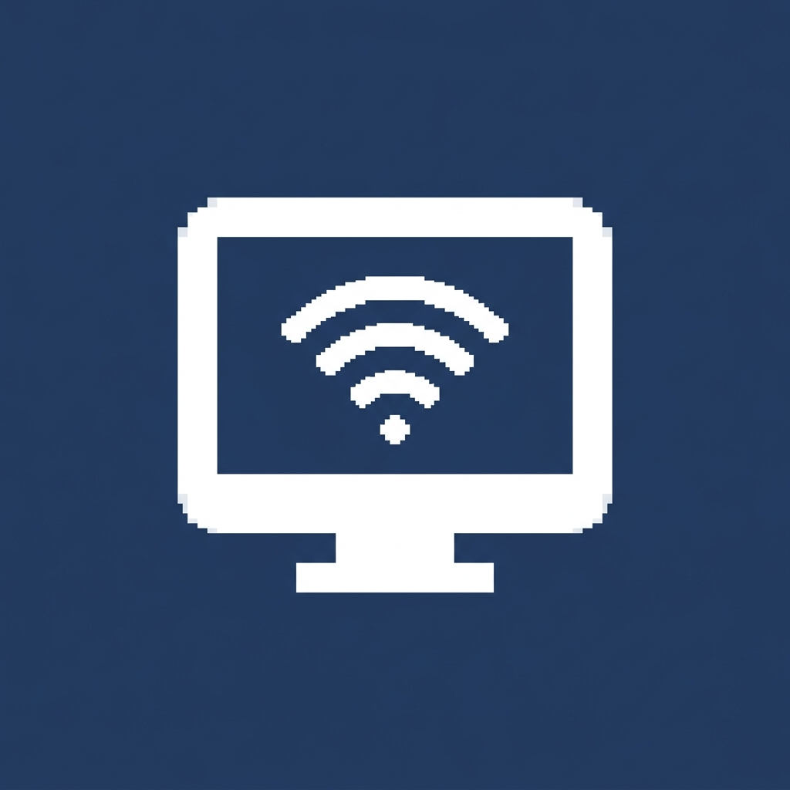
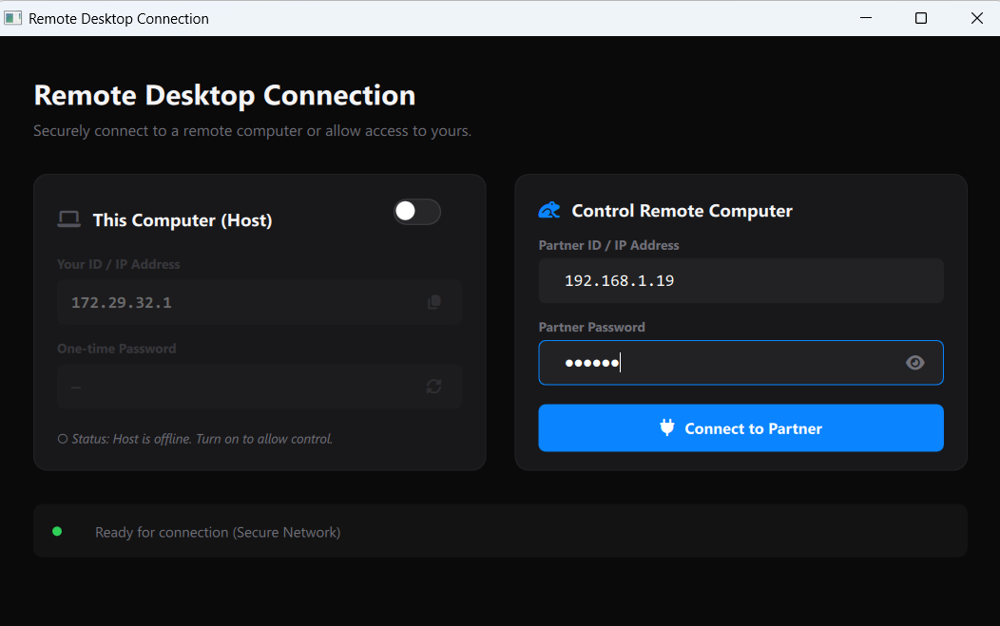
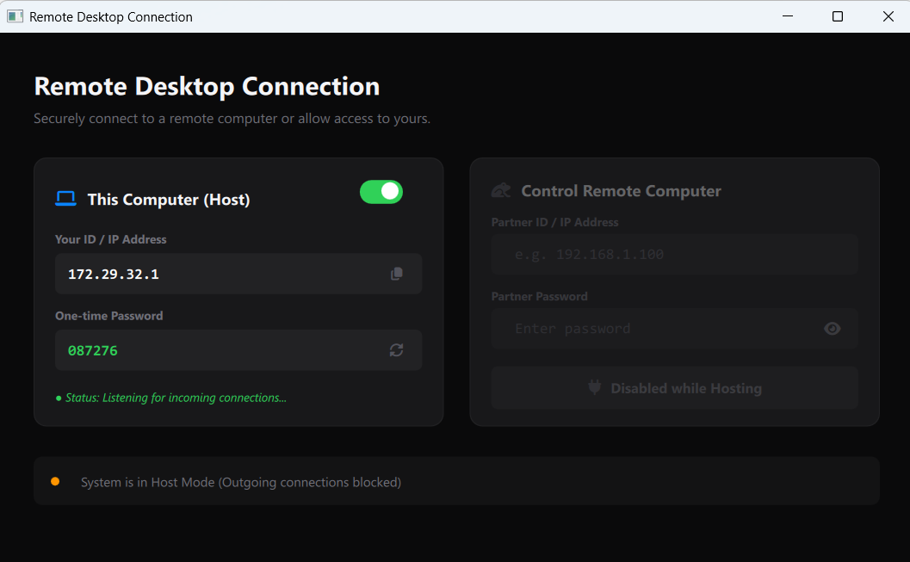
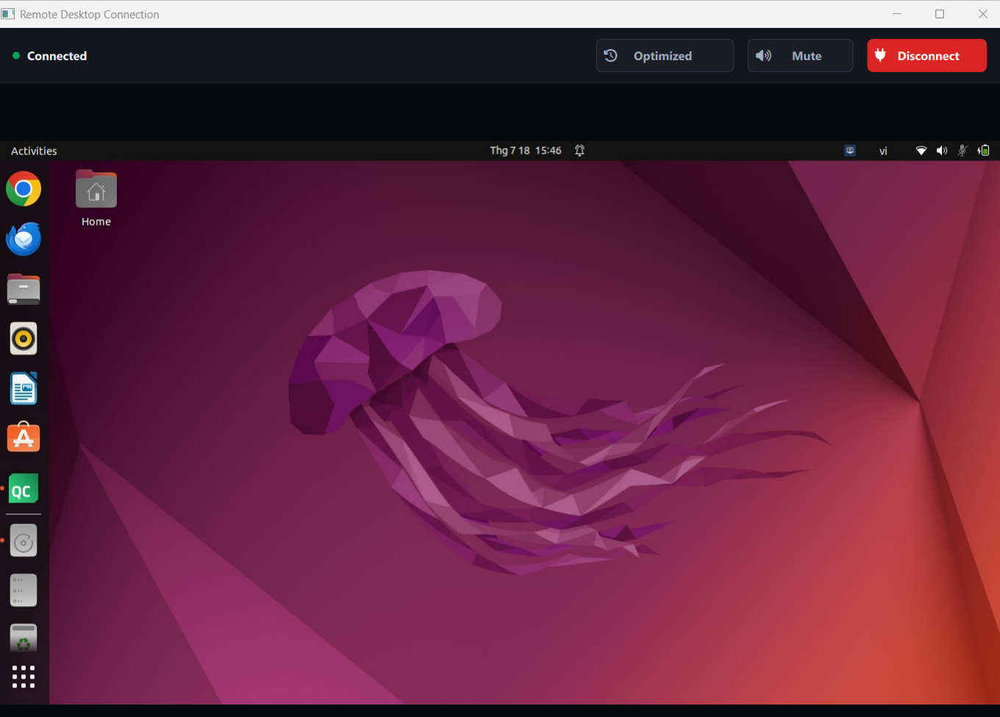

<p align="center">
  
</p>

<h1 align="center">Remote Desktop Connection</h1>

<p align="center">
  <strong>A cross-platform, high-performance remote desktop application for real-time screen sharing, audio streaming, and full input control over LAN.</strong>
</p>

<p align="center">
  
  
  
  
</p>

<p align="center">
  <a href="README.md">en English</a> · <a href="README_VI.md">🇻🇳 Tiếng Việt</a>
</p>

---

## 📖 Overview

**Remote Desktop Connection** is a lightweight, native remote desktop tool built with **C++**, **Qt6 (QML)**, and **CMake**. It enables secure, low-latency control of remote computers within a local area network (LAN).

### What it does

| Capability               | Description                                                                                      |
| :------------------------ | :----------------------------------------------------------------------------------------------- |
| 🖥️ **Screen Streaming**  | Real-time screen capture with frame-diff detection and dual compression modes (JPEG / Zlib)       |
| 🔊 **Audio Loopback**    | System audio capture & playback via WASAPI (Windows) or PulseAudio (Linux)                        |
| 🖱️ **Input Simulation**  | Full mouse & keyboard relay through Win32 `SendInput` or X11 XTest extension                      |
| 📋 **Clipboard Sync**    | Bidirectional real-time text clipboard synchronization                                            |
| 🔐 **Authentication**    | One-time 6-digit passcode generated per host session                                              |

---

## 📷 Screenshots

### Connection Dashboard
*Host offline — ready to start hosting or connect to a partner.*



### Host Mode Active
*Listening for incoming client connections with auto-generated passcode.*



### Remote Control Session
*Live screen streaming with audio, input control, and quality toggle.*



---

## ✨ Features in Detail

### Screen Capturing & Streaming

- **Frame-diff detection** — Uses fast binary memory comparison (`memcmp`) on raw pixel data; only changed frames are transmitted, drastically reducing bandwidth.
- **Dual compression modes:**
  - **Optimized (default):** JPEG at 90% quality — excellent balance of clarity and bandwidth.
  - **Lossless:** RGB32 → Zlib (level 1, fastest) — pixel-perfect fidelity when needed.
- **Client-side toggle** — Switch between modes on-the-fly during an active session.

### System Audio Loopback

| Platform | Technology | Details |
| :------- | :--------- | :------ |
| **Windows** | WASAPI Loopback | Captures from the default output device via `AUDCLNT_STREAMFLAGS_LOOPBACK`. Auto-converts Float32 PCM → Int16 PCM. |
| **Linux** | PulseAudio (`parec`) | Captures from the default monitor sink. Falls back to `QAudioSource` querying `monitor` / `loopback` devices. |

- Real-time playback on the client via `QAudioSink` with buffering.
- Mute / Unmute toggle available in the control UI.

### Mouse & Keyboard Simulation

- **Coordinate mapping** — `ScreenRenderer` accurately maps QML window coordinates → host's native screen resolution.
- **Windows:** Win32 `SendInput` API — supports move, left/right/middle click, scroll wheel, key press/release.
- **Linux:** X11 XTest extension — `XTestFakeMotionEvent`, `XTestFakeButtonEvent`, `XTestFakeKeyEvent`.
- **Mouse throttling** — Outgoing mouse move events are throttled via `QTimer` to prevent network flooding.

### Clipboard Synchronization

- Bidirectional, real-time text sync between host and client.
- Duplicate detection prevents infinite clipboard echo loops.

### Security & UX

- **One-time passcode** — Random 6-digit PIN generated per host session.
- **Single instance protection** — `QSharedMemory` ensures only one app instance runs at a time.
- **System tray minimization** — Host window auto-hides to tray on client connect; restored via tray context menu.
- **Modern dark theme** — Premium Slate 900 / Navy Blue UI with FontAwesome icons, smooth animations, and toast notifications.

---

## 🏗️ Architecture

```
┌──────────────────────────────────────────────────────────┐
│                       QML Frontend                       │
│  Home.qml (Dashboard)  ·  Control.qml (Remote Session)  │
│                     Toast.qml (Popups)                   │
└───────────────────────────┬──────────────────────────────┘
                            │ Q_INVOKABLE / Q_PROPERTY
┌───────────────────────────▼──────────────────────────────┐
│                    Core Layer (C++)                       │
│  ConnectionManager  ·  ScreenRenderer  ·  SystemTray     │
│  ClipboardManager   ·  AudioLoopbackCapture              │
│  NetworkManager                                          │
└───────────────────────────┬──────────────────────────────┘
                            │
┌───────────────────────────▼──────────────────────────────┐
│                   Network Layer (TCP)                     │
│  RemoteServer ←→ PacketStream ←→ RemoteClient            │
│               Packet · Protocol                          │
│  Port: 5000  ·  Magic: 0x52444B54 ("RDKT")              │
└──────────────────────────────────────────────────────────┘
```

### Protocol Packet Types

```
Authentication:  AuthRequest → AuthSuccess / AuthFailed
Screen:          ScreenFrame (JPEG or Zlib compressed)
Input:           MouseMove · MousePress · MouseRelease · MouseWheel
                 KeyPress · KeyRelease
Clipboard:       Clipboard (text payload)
Audio:           AudioFrame (Int16 PCM samples)
Health:          Ping ↔ Pong
Settings:        SettingsUpdate (compression mode toggle)
```

---

## 📁 Project Structure

```text
REMOTE_PC/
├── main.cpp                             # Application entry point
├── CMakeLists.txt                       # CMake build configuration
│
├── backend/
│   ├── core/                            # Core system modules
│   │   ├── ConnectionManager.h/cpp      # Central state machine & QML bridge
│   │   ├── ScreenRenderer.h/cpp         # Renders incoming frames onto QML canvas
│   │   ├── AudioLoopbackCapture.h/cpp   # System audio capture (WASAPI / parec)
│   │   ├── ClipboardManager.h/cpp       # Bidirectional clipboard sync
│   │   ├── NetworkManager.h/cpp         # Local IP address discovery
│   │   └── SystemTray.h/cpp             # Tray icon, notifications & context menu
│   │
│   └── network/                         # TCP communication layer
│       ├── Protocol.h                   # Packet types, magic number, compression enum
│       ├── Packet.h/cpp                 # Packet data structure
│       ├── PacketStream.h/cpp           # Serialization / deserialization of TCP streams
│       ├── RemoteServer.h/cpp           # Host-side: capture, broadcast, input simulation
│       └── RemoteClient.h/cpp           # Client-side: connect, render, relay input
│
├── qml/                                 # QML frontend
│   ├── Home.qml                         # Main dashboard (Host / Client mode selection)
│   ├── Control.qml                      # Remote session window (display + controls)
│   └── components/
│       └── Toast.qml                    # Toast notification component
│
├── fonts/
│   └── as7.otf                          # FontAwesome 7 icon font
│
├── icons/
│   └── tray_icon.png                    # System tray icon
│
└── results/                             # Screenshots for documentation
    ├── connect_page.png
    ├── host_page.png
    └── control_page.png
```

---

## 🛠️ Requirements

### Dependencies

| Dependency | Version | Notes |
| :--------- | :------ | :---- |
| **Qt6 SDK** | 6.10+ | Modules: `Gui`, `Qml`, `Quick`, `QuickControls2`, `Network`, `QuickEffects`, `Multimedia`, `Widgets` |
| **C++ Compiler** | C++17+ | MSVC, GCC, or Clang |
| **CMake** | 3.16+ | Build system |

> **Download Qt:** [Qt Open Source Installer](https://www.qt.io/development/download-qt-installer-oss)

### Platform-Specific

<details>
<summary><strong>🪟 Windows</strong></summary>

No additional dependencies. The application uses built-in Win32 APIs:
- **COM / WASAPI** for audio loopback capture
- **SendInput** for input simulation

</details>

<details>
<summary><strong>🐧 Linux (X11)</strong></summary>

Install X11 and PulseAudio development packages:

```bash
# Ubuntu / Debian
sudo apt-get install libx11-dev libxtst-dev pulseaudio-utils

# Fedora
sudo dnf install libX11-devel libXtst-devel pulseaudio-utils

# Arch Linux
sudo pacman -S libx11 libxtst pulseaudio
```

</details>

---

## 🚀 Build & Run

### Build with CMake

```bash
# Configure
cmake -B build -S . -DCMAKE_BUILD_TYPE=Release

# Build
cmake --build build --config Release
```

### Run

```bash
# Windows
.\build\Release\appLR_02.exe

# Linux
./build/appLR_02
```

> **Tip:** You can also open the project directly in **Qt Creator** by loading `CMakeLists.txt`.

---

## 💡 Usage Guide

### 1. Host — Allow Remote Control

1. Launch the application.
2. In the **This Computer (Host)** panel, toggle the switch to **ON**.
3. Your **local IP address** and a **6-digit passcode** will appear.
4. Share these credentials with the person who needs to connect.
5. Once a client connects, the window auto-hides to the **system tray**.
6. Right-click the tray icon to restore the window or shut down.

### 2. Client — Control a Remote PC

1. Launch the application.
2. In the **Control Remote Computer** panel, enter the host's **IP address** and **passcode**.
3. Click **Connect to Partner**.
4. The remote desktop window opens with the following controls:

| Control | Action |
| :------ | :----- |
| **Mouse & Keyboard** | Interact naturally — all input is relayed to the host |
| **Quality Toggle** | Switch between *Optimized* (JPEG) and *Lossless* (Zlib) |
| **Audio Toggle** | Mute / Unmute the host's system audio stream |
| **Disconnect** | End the remote session cleanly |

---

## 🔧 Configuration

| Parameter | Default | Location |
| :-------- | :------ | :------- |
| TCP Port | `5000` | `Protocol.h` → `DefaultPort` |
| JPEG Quality | `90%` | `RemoteServer.cpp` |
| Zlib Compression Level | `1` (fastest) | `RemoteServer.cpp` |
| Capture Interval | Timer-based | `RemoteServer` → `m_captureTimer` |

---

## 🛡️ License & Contributing

This project is designed for **secure, low-latency remote control over LAN**. Contributions are welcome — feel free to submit pull requests or open issues for enhancements and bug fixes.
